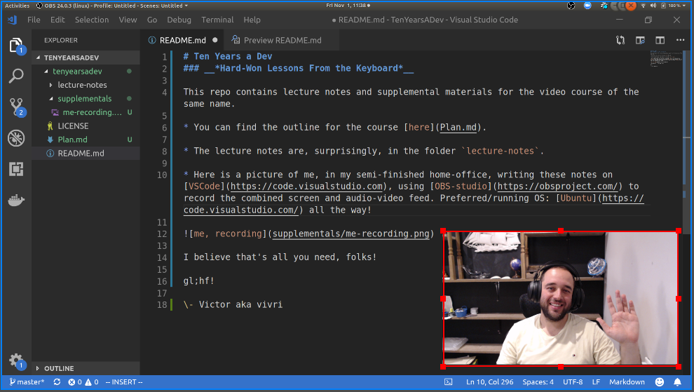

# Ten Years a Dev
### __*Hard-Won Lessons From the Keyboard*__

This repo contains lecture notes and supplemental materials for the video course of the same name.

* You can find the outline for the course [here](Plan.md).

* The lecture notes are, surprisingly, in the folder `lecture-notes`.

* Here is a picture of me, in my semi-finished home-office, writing these notes on [VSCode](https://code.visualstudio.com), using [OBS-studio](https://obsproject.com/) to record the combined screen and audio-video feed. Preferred/running OS: [Ubuntu](https://code.visualstudio.com/) all the way!

 
I believe that's all you need, folks!

gl;hf!

\- Victor aka vivri